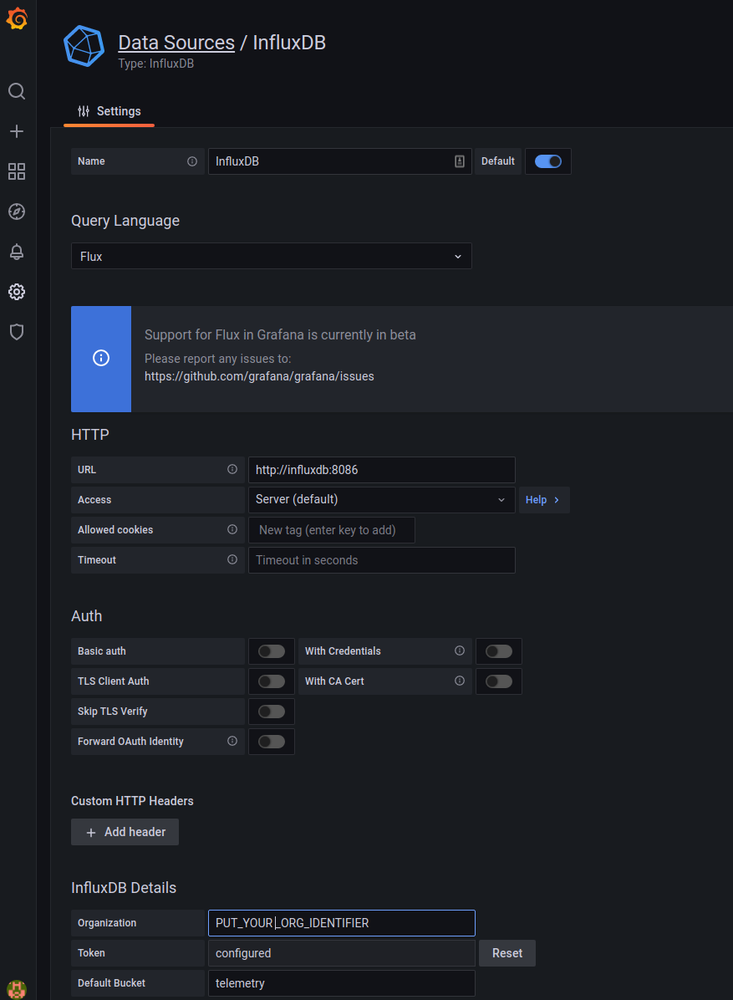
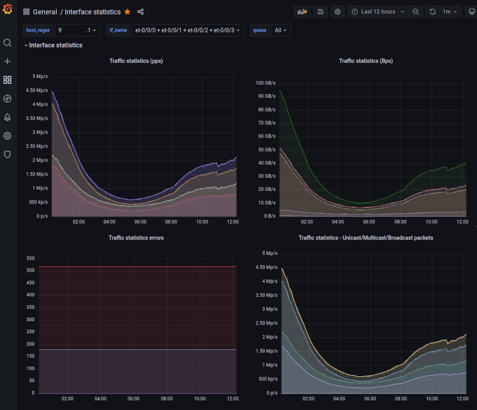
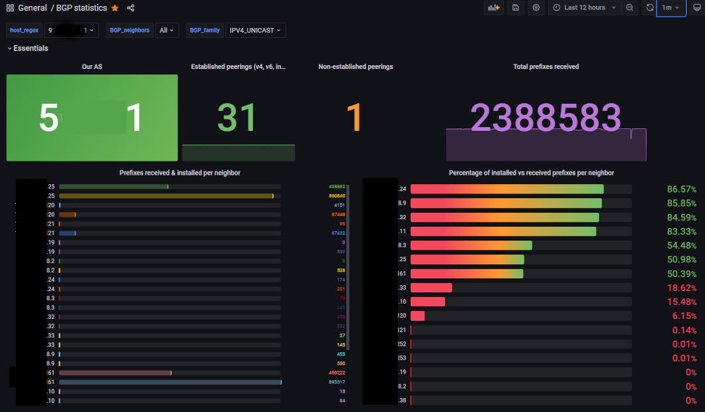
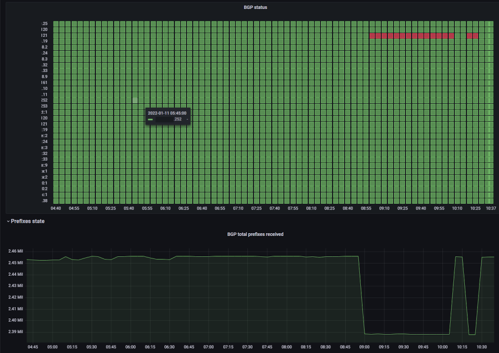

# Network telemetry with TIG stack
## Introduction
This repository encompasses the required components to deploy a Telegraf/InfluxDB/Grafana (TIG) stack necessary to ingest and depict telemetry data originated by Juniper MX routers. The work was stimulated by the corresponding efforts in [open-nti](https://github.com/Juniper/open-nti), which seem not to be maintained anymore and consequently some of its components lack features. Furthermore, an additional challenge is the use of the Flux query language instead of InfluxQL.

## Components
All required software components are deployed using containers; [docker-compose](https://docs.docker.com/compose/) is a prerequisite to run the Docker applications. 
The following applications comprise the TIG stack:
* [traefik](https://doc.traefik.io/traefik/): An open source reverse proxy and load balancer that facilitates the deployment of microservices. Among others, it may also issue a X.509 certificate from Let's encrypt public CA.
* [InfluxDB](https://www.influxdata.com): is a Time Series DataBase that stores the routers' telemetry metrics after being processed and transformed to a proper format.
* [Telegraf](https://github.com/influxdata/telegraf): Telegraf is an agent for collecting, processing, aggregating, and writing metrics. Nowadays, its core includes the JTI OpenConfig plugin necessary to decode the gNMI data so there is no need for additional modules.
* [Grafana](https://grafana.com): Grafana is an interactive visualisation platform. It supports natively InfluxDB as data source and one can create dashboards with queries using the Flux query language (note though that the visual query builder doesn't support Flux at the time this README file was compiled).

## Installation
 1. Before you bring up the containers, visit the `configuration.env` file and modify the variables to fit your environment and preferences;
 1. Edit `config/telegraf/telegraf.conf` and put the IPs of the routers that will stream telemetry;
 1. When ready execute `docker-compose up -d` to start the applications. During the first execution traefik will issue a new certificate so it may take some time before it replies to requests;
 1. Login to grafana using the credentials your chose and add a new data source as in the following image:
 ;
 1. Import the dashboards available in the `dashboard` directory;
 1. Visit https://FQDN and login using the defined credentials;
 
## Router configuration
An analysis of Junos telemetry is out of the scope for this README; you may refer to a detailed handbook that is available in vendor's documentation [repository](https://www.juniper.net/documentation/us/en/software/junos/interfaces-telemetry/interfaces-telemetry.pdf). 
In principle, Juniper offers two data models with a different transport to facilitate telemetry streaming. Both of them utilize [Google protocol buffer](https://developers.google.com/protocol-buffers/) structured messages.
You may enable telemetry services by importing the following stanza in your router. Just replace the IPv4 and IPv6 addresses in the `allow-client` list with the IP(s) of the server hosting the containers:
```
[system services extension-service]

request-response {
    grpc {
        clear-text {
            port 50051;
        }
        skip-authentication;
    }
}
notification {
    allow-clients {
        address [A.B.C.D/32 E:F:G:H:I:J:K:L/128];
    }
}
```
You may confirm successful configuration by executing the following commands:
```
show extension-service request-response servers
show agent sensors 
```

## Screenshots
.
.
.

## Credits
Credits to [leopoul](https://github.com/leopoul) for his valuable contribution.
